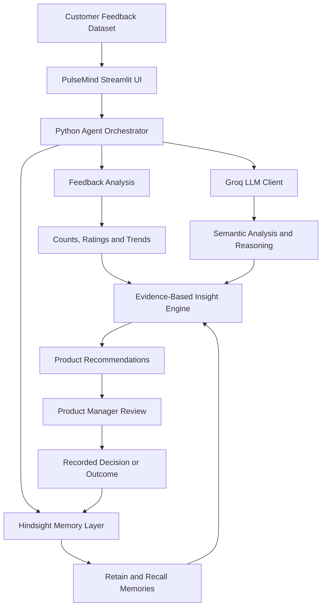

# PulseMind 

### Memory-Driven Product Intelligence Agent

**PulseMind helps product teams understand what customers are saying, remember what they have already tried, evaluate outcomes, and identify what they should investigate next.**

Instead of treating every customer feedback report as an isolated event, PulseMind connects feedback across time with product changes, observed outcomes, and previous decisions using persistent memory powered by Hindsight.

> **Core idea:** Feedback → Product Change → Outcome → Learning → Next Action

---

##  Table of Contents

* [Overview](#-overview)
* [Problem Statement](#-problem-statement)
* [Our Solution](#-our-solution)
* [Key Features](#-key-features)
* [How PulseMind Works](#-how-pulsemind-works)
* [System Architecture](#-system-architecture)
* [Technology Stack](#-technology-stack)
* [How Hindsight Is Used](#-how-hindsight-is-used)
* [Role of Groq](#-role-of-groq)
* [Reference and Inspiration](#-reference-and-inspiration)
* [Installation and Setup](#-installation-and-setup)
* [Environment Configuration](#-environment-configuration)
* [Running PulseMind](#-running-pulsemind)
* [Demo Scenario](#-demo-scenario)
* [Data and Evaluation](#-data-and-evaluation)
* [Limitations](#-limitations)
* [Future Improvements](#-future-improvements)
* [Project Structure](#-project-structure)
* [Contributing](#-contributing)
* [Acknowledgements](#-acknowledgements)

---

##  Overview

Product teams receive feedback through reviews, surveys, support conversations, and other customer interactions. The challenge is not just understanding individual complaints. It is remembering historical problems, connecting them with previous product changes, and understanding whether those changes improved the customer experience.

PulseMind is an AI-powered product intelligence application designed to help product managers move from reactive feedback analysis to memory-driven decision support.

It combines persistent memory, language-model reasoning, and deterministic data analysis to build historical context around customer feedback.

### What makes PulseMind different?

A conventional feedback dashboard may tell a product manager that customers are complaining about checkout.

PulseMind aims to answer deeper questions:

* Have customers complained about this before?
* What did the team change to address it?
* What happened after that change?
* Are the original complaints decreasing?
* Is another problem emerging?
* What should the product team investigate next?

The goal is to make historical context useful during current product decisions.

---

##  Problem Statement

Product teams often struggle with disconnected customer feedback and product decisions.

Common challenges include:

* **Fragmented feedback:** Customer opinions are spread across different records and time periods.
* **Repeated investigations:** Teams may revisit problems without remembering earlier findings.
* **Missing historical context:** Current complaints are often analysed without considering previous product changes.
* **Unclear outcomes:** Teams may record a feature release without systematically comparing subsequent feedback.
* **Delayed issue detection:** A new complaint category may grow while attention remains focused on an older problem.
* **Lost organisational knowledge:** Important lessons can disappear between meetings, releases, and product decisions.

Traditional dashboards are useful for measuring what is happening now, but historical reasoning requires connecting events over time.

---

##  Our Solution

PulseMind introduces a memory-driven AI agent that connects customer feedback, product changes, outcomes, and product-team decisions.

The application combines:

1. **Feedback analysis** to organise customer comments and ratings.
2. **Historical memory** to retain and retrieve relevant information using Hindsight.
3. **AI reasoning** using Groq-powered language models.
4. **Deterministic analytics** to calculate counts, percentages, and trends from available data.
5. **Evidence-based insights** to connect historical context with current problems.
6. **Decision support** to help product managers identify the next investigation.

PulseMind is designed to accumulate useful context across interactions instead of answering every question from the current dataset alone.

---

##  Key Features

### 1. Executive Dashboard

Provides an overview of available feedback and product activity.

Depending on the available dataset, the dashboard can display:

* Total feedback records.
* Customer rating distributions.
* Feedback sentiment and complaint categories.
* Changes in feedback volume over time.
* Recent product changes.
* Emerging themes and relevant insights.

All displayed metrics should be calculated from the loaded data rather than invented by the language model.

### 2. Feedback Explorer

Allows product teams to explore individual feedback records.

Capabilities include:

* Browsing customer feedback.
* Reviewing feedback text, ratings, and dates.
* Filtering records using available categories and other supported fields.
* Investigating recurring customer complaints.
* Identifying records relevant to a product change.

### 3. Product Changes

Provides a place to record product changes and their intended purpose.

Product managers can document information such as:

* Product change name.
* Description of the change.
* Release or change date.
* Customer problem being addressed.
* Expected outcome.
* Observed outcome when measurements become available.

PulseMind must distinguish a recorded change from a verified improvement. A change should not be described as successful without supporting evidence.

### 4. Insights and Emerging Themes

Helps product teams investigate patterns across feedback and historical context.

Potential insights include:

* Recurring complaint categories.
* Changes in ratings or complaint volume.
* Problems that persist after a product change.
* New issues that deserve investigation.
* Historical product changes related to current complaints.

Recommendations are intended to be grounded in available feedback, calculated trends, and retrieved memories.

### 5. Hindsight Memory Explorer

Makes the application's persistent memory visible.

Users can inspect relevant memories retrieved from Hindsight, where supported, and understand how historical information contributes to an answer.

This is a core component of PulseMind because the application is designed to retain useful information and reuse it in later interactions.

### 6. Ask PulseMind

Allows product managers to ask questions in natural language.

Example questions:

* What have we learned from customer feedback so far?
* Did the latest checkout change improve the experience?
* Which complaint needs further investigation?
* What product changes were made to address checkout problems?
* What happened after the previous change?
* What should we investigate next?

When historical context is available, PulseMind can retrieve relevant Hindsight memories and use them to inform its response.

---

##  How PulseMind Works

The intended workflow follows a continuous product-learning cycle.

**Step 1 — Collect**

Load customer feedback from the available demo dataset or a supported imported dataset.

**Step 2 — Analyse**

Use Python to calculate measurable statistics and organise feedback. Use language-model reasoning where semantic interpretation is needed.

**Step 3 — Remember**

Retain relevant information in Hindsight, including feedback-related facts, product changes, and outcomes supported by the application.

**Step 4 — Recall**

When a new question arrives, retrieve relevant historical memories from Hindsight.

**Step 5 — Connect**

Combine retrieved context with current feedback and calculated trends.

**Step 6 — Recommend**

Generate a recommendation or identify an investigation that is supported by the available evidence.

**Step 7 — Learn from outcomes**

When a product change and its subsequent outcome are recorded, retain the relevant information so it can inform future analysis.

The long-term goal is to create a feedback loop in which each interaction contributes useful context to subsequent product decisions.

---

##  System Architecture



### Architecture responsibilities

| Component      | Responsibility                                           |
| -------------- | -------------------------------------------------------- |
| Streamlit      | User interface and interaction                           |
| Python         | Application orchestration and deterministic calculations |
| Hindsight      | Persistent memory retention and retrieval                |
| Groq           | Language-model reasoning and analysis                    |
| CSV datasets   | Demo feedback and recorded product-change data           |
| Insight engine | Combines relevant evidence into product insights         |

The diagram represents the intended workflow. Actual integrations and operations must be verified against the implementation.

---

##  How Hindsight Is Used

Repository: https://github.com/vectorize-io/hindsight

Hindsight is the central memory component of PulseMind.

A conventional language-model interaction may have access only to the current prompt and supplied context. PulseMind uses Hindsight to preserve and retrieve relevant information across interactions.

### Memory lifecycle

**1. Retain**

Store relevant information from the application's supported workflow, such as customer feedback, recorded product changes, and observed outcomes.

**2. Recall**

Retrieve memories relevant to a new question or investigation.

**3. Reason with historical context**

Combine retrieved memories with current feedback and deterministic analytics.

**4. Retain new learning**

Where the corresponding workflow is implemented, record subsequent outcomes or decisions so that future questions can use that context.

### Why persistent memory matters

Consider two questions:

* Without historical context: "What are customers complaining about today?"
* With historical context: "What are customers complaining about today, what did we previously change, and what happened afterward?"

The second question requires more than a summary of current feedback. It requires connecting events and retrieving information from earlier interactions.

That is the role of Hindsight in PulseMind.

---

##  Role of Groq

Groq provides access to language models used for AI-powered analysis and reasoning.

In PulseMind, the language model can support tasks such as:

* Interpreting natural-language questions.
* Analysing the meaning of customer comments.
* Summarising retrieved historical context.
* Connecting relevant memories with current feedback.
* Producing evidence-based recommendations.

Exact statistics, counts, percentages, and other measurable values should be calculated by Python from the available data.

This separation helps reduce incorrect calculations and makes results easier to verify.

### Configuration

PulseMind reads its configuration from environment variables. The actual model names are configurable and should match the installed application.

---

##  Reference and Inspiration

### Self-Driving Agents

Reference repository: https://github.com/vectorize-io/self-driving-agents

PulseMind takes inspiration from the broader idea of specialised AI agents that work toward defined responsibilities and use context to support their tasks.

The reference is used for inspiration around agent-oriented workflows and practical AI applications.

**Important distinction:** The self-driving-agents repository is a reference, not a runtime dependency of PulseMind. PulseMind's core implementation is based on its own Python workflow, Hindsight memory integration, Groq-powered reasoning, and Streamlit interface.

PulseMind focuses specifically on one problem: helping product teams connect customer feedback with historical product changes and outcomes.

---

##  Technology Stack

| Technology     | Purpose                                   |
| -------------- | ----------------------------------------- |
| Python         | Application logic and orchestration       |
| Streamlit      | Interactive application interface         |
| Hindsight      | Persistent AI memory                      |
| Groq API       | Language-model reasoning                  |
| Pandas         | Tabular feedback processing, where used   |
| CSV            | Demo feedback and product-change datasets |
| Git and GitHub | Version control and source-code hosting   |

The exact dependencies are defined in `requirements.txt`. Refer to that file for the definitive list of packages used by the current implementation.

---

##  Installation and Setup

### Prerequisites

Before running PulseMind, install:

* Python compatible with the project's dependencies.
* Git.
* A Groq API key.
* The dependencies listed in `requirements.txt`.

Hindsight must also be configured according to the project's selected embedded-server setup.

### 1. Clone the repository

Replace the placeholder below with your actual public GitHub repository URL.

```bash
git clone YOUR_GITHUB_REPOSITORY_URL
cd hackwithhyd
```

Alternatively, open the existing project directory if you have already downloaded or cloned it.

### 2. Create a virtual environment

On Windows PowerShell:

```powershell
python -m venv .venv
```

Activate it:

```powershell
.\.venv\Scripts\Activate.ps1
```

If PowerShell blocks activation, follow your system's Python virtual-environment guidance rather than changing security settings unnecessarily.

### 3. Install dependencies

```powershell
python -m pip install --upgrade pip
pip install -r requirements.txt
```

If Hindsight's embedded package is not included in the existing requirements, follow the installation instructions for the version used by the project. Avoid installing conflicting package versions without checking compatibility.

### 4. Configure environment variables

Create a local `.env` file from `.env.example`, if the example file exists.

```powershell
Copy-Item .env.example .env
```

Edit `.env` and provide your own Groq API key.

Do not upload `.env` to GitHub.

### 5. Start the application

From the project root, run:

```powershell
streamlit run app.py
```

If the current project documents a different startup command, use that command instead.

Open the local URL printed by Streamlit in your browser.

---

##  Environment Configuration

An example configuration is shown below. Keep only the variables actually supported by your application's configuration code.

```dotenv
GROQ_API_KEY=your_groq_api_key
GROQ_MODEL=openai/gpt-oss-120b

HINDSIGHT_BANK_ID=pulsemind
HINDSIGHT_MODE=embedded
HINDSIGHT_LLM_PROVIDER=groq

PULSEMIND_DATA_DIR=data
```

Your actual project may also use separate settings for Hindsight's memory model, reasoning model, server URL, or authentication.

Use the variable names and model identifiers expected by the existing implementation. Never put real API keys in this README, screenshots, source code, or version control.

Groq access and rate limits depend on the account and selected model. Check the provider's current documentation for availability and limits.

---

##  Demo Scenario

PulseMind can be demonstrated through a prepared, time-based product-feedback scenario.

### Stage 1 — Identify the initial problem

Customers report friction during checkout.

PulseMind analyses the available feedback and identifies checkout as a problem area.

### Stage 2 — Record a product change

The product manager records a checkout improvement and its expected outcome.

The change date and description come from the recorded product-change data.

### Stage 3 — Evaluate subsequent feedback

Later feedback is analysed to determine whether checkout-related complaints changed and whether other complaint categories emerged.

Any reported improvement must be calculated from actual records in the selected dataset.

### Stage 4 — Recall historical context

The product manager asks PulseMind what happened after the previous change.

PulseMind retrieves relevant Hindsight memories and uses the available outcome evidence to answer.

### Stage 5 — Recommend the next investigation

If the data shows that checkout complaints declined while another complaint category increased, PulseMind can identify that pattern and recommend investigating the new issue.

The recommendation should be presented as a proposed next step, not proof of causation.

**Demo-data disclaimer:** Prepared demonstration records illustrate the workflow. They are not real customer findings unless the application has been populated with genuine, appropriately sourced customer data.

---

##  Data and Evaluation

PulseMind separates measurable analysis from AI interpretation.

### Deterministic analysis

Python should calculate measurable results such as:

* Number of feedback records.
* Average ratings.
* Category frequencies.
* Period-over-period changes.
* Complaint percentages.
* Rating differences before and after a recorded change.

### AI-supported interpretation

The language model can help interpret feedback, explain historical patterns, and formulate recommendations using retrieved memories and available evidence.

### Evaluation checklist

Before presenting a result as verified, check:

* Are the dates and chronology correct?
* Are the rating calculations correct?
* Are the metrics calculated from the selected dataset?
* Are the memories returned by the actual Hindsight service?
* Does the answer cite or identify relevant supporting evidence?
* Is the recommendation consistent with the evidence?
* Are demo records clearly distinguished from real customer feedback?
* Are failures reported rather than hidden by fabricated fallback responses?

A before-memory versus after-memory comparison can help demonstrate the value of persistent memory, provided both outputs are generated through the intended workflows.

---

##  Limitations

PulseMind's conclusions depend on the quality, coverage, and accuracy of the available feedback and product-change records.

Current limitations to communicate clearly include:

* Prepared demo data does not establish real-world customer impact.
* Recorded product changes do not independently prove that a change caused an outcome.
* AI-generated interpretations can be incorrect and require evidence-based validation.
* Missing historical records can limit memory retrieval and comparisons.
* Groq availability and rate limits can affect AI-powered operations.
* Persistent memory is only useful when relevant information is correctly retained and retrieved.
* External integrations should not be assumed to exist unless they have been implemented and tested.

The application should clearly distinguish observed facts, calculated measurements, retrieved historical information, and AI-generated recommendations.

---

##  Future Improvements

Potential future extensions include:

* Integrating customer support platforms and feedback sources.
* Connecting GitHub or project-management systems to retrieve verified product changes.
* Supporting larger real-world feedback datasets.
* Improving theme detection and historical trend analysis.
* Adding more robust outcome evaluation.
* Providing richer memory provenance and evidence inspection.
* Evaluating recommendation quality with repeatable test datasets.
* Adding authentication and deployment-ready configuration.
* Monitoring model errors, latency, and memory retrieval quality.

These are future directions, not claims about functionality already implemented.

---

##  Project Structure

The project is organised around a Python application, a Streamlit interface, data files, and service modules.

An example of the expected high-level structure is:

```text
hackwithhyd/
├── app.py
├── requirements.txt
├── .env.example
├── .gitignore
├── README.md
├── core/
│   ├── config.py
│   └── hindsight_client.py
├── services/
│   ├── feedback_analysis.py
│   ├── insight_engine.py
│   └── recommendation_engine.py
├── data/
│   ├── feedback.csv
│   └── product_changes.csv
├── tests/
└── ui/
```

The exact files may differ. Update this section to match the actual repository rather than creating placeholder files solely to match the diagram.

---

##  Contributing

Contributions and suggestions are welcome.

1. Fork the repository.
2. Create a branch for your change.
3. Implement the change and add appropriate tests.
4. Run the relevant test suite.
5. Submit a pull request describing the change and its impact.

Please avoid committing credentials, private customer information, or unverified claims about application functionality.

---

##  Acknowledgements

* **Hindsight:** https://github.com/vectorize-io/hindsight — persistent memory infrastructure for AI applications.
* **Self-Driving Agents:** https://github.com/vectorize-io/self-driving-agents — reference and inspiration for agent-oriented workflows.
* **Groq:** https://groq.com/ — language-model inference platform.
* **Streamlit:** https://streamlit.io/ — Python application framework.

---

##  Final Note

PulseMind is built around a simple principle:

**An AI product assistant should not only analyse what customers are saying now. It should use what the team has learned before to help decide what to investigate next.**

By combining persistent memory, data-driven analysis, and language-model reasoning, PulseMind aims to make customer feedback more useful across the product development lifecycle.